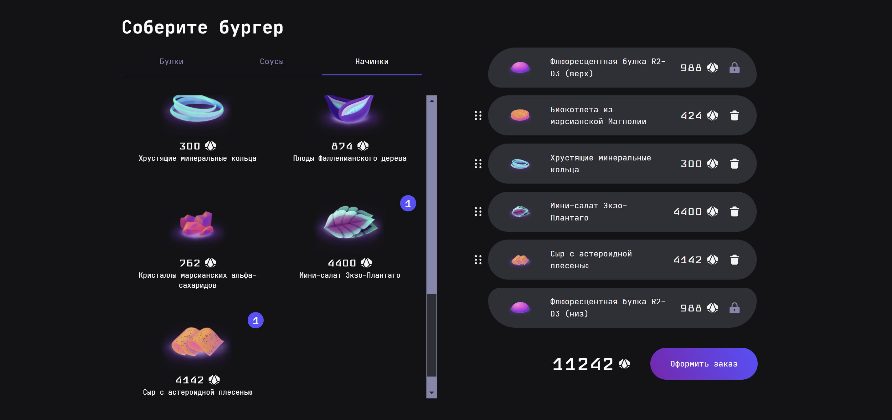

# Проект Stellar-Burgers

### Технологии
  
  
[](https://nginx.org/ru/)
[](https://www.docker.com/)
[](https://github.com/features/actions)

### Содержание

[Описание](#description)  
[Как запустить проект](#start)  
[Команда проекта](#team)

<a name="description"><h3>Описание проекта</h3></a>
___

«Stellar-Burgers» — сайт, футуристичной бургерной. Где посетители сайта - космические путешественники со всей вселенной, могут попробовать лучшие бургеры галактики млечного пути.

<p align="center"></p>

Проект доступен по [ссылке](https://stellar-burger.ru).

Проект состоит из следующих страниц: 
* Конструктор - список ингредиентов и конструктор бургера. При прокрутке списка ингредиентов меняются вкладки категорий. Создание будущего бургера реализованно с помощью технологии drag & drop - перетаскиванием нужного ингредиента. При наведении перетаскиваемым ингредиентом на область конструктора подсвечивается соответствующая ингредиенту область конструктора. При добавлении ингредиента в бургер, в списке ингредиентов, на используемом ингредиенте отражается количество.   
* Лента заказов - список последних 50 заказов. Доступна всем пользователям. Изменения в списке отражаются в онлайне режиме. Данные летны обновляются по websocket. 
* Личный кабинет - страница где пользователь может отредактировать свои учётные данные. Посмотреть список своих заказов, и покинуть ресурс.

<p align="right">(<a href="#description">Вернуться в начало</a>)</p>

<a name="start"><h3>Как запустить проект:</h3></a>
___
Проведите подготовку своего сервера к запуску проекта.

* Подключитесь к своему удаленному серверу. 

* Обновите систему:
  
  ```angular2html
  sudo apt-get update && sudo apt-get -y install -f && sudo apt-get -y full-upgrade && sudo apt-get -y autoremove && sudo apt-get -y autoclean && sudo apt-get -y clean
  ```

* Установите [docker](https://docs.docker.com/engine/install/ubuntu/#install-using-the-convenience-script):

  ```angular2html
  sudo apt install curl
  curl -fsSL https://test.docker.com -o test-docker.sh
  sudo sh test-docker.sh
  ```

* Проверьте, что Docker работает:

  ```angular2html
  sudo systemctl status docker
  ```

* Если требуется, становите права пользователя для docker-compose:

  ```angular2html
  sudo chmod +x /usr/local/bin/docker-compose
  ```

* Авторизуйтесь с удаленного сервера на DockerHub:

  ```angular2html
  sudo docker login --username=<your_docker_hub_user_name>
  ```

* В корневой директории создайте папку stellar-burgers.

  ```angular2html
  mkdir stellar-burgers
  ```

Проведите подготовку проекта на локальном компьютере:

* Клонируйте репозиторий проекта на свой локальный компьютер по SSH ссылке:

  ```angular2html
  git@github.com:Konstantin-Leontyev/Stellar-Burgers.git
  ```

<!-- * Создайте .env файл и заполните его согласно примеру в .env.example: -->

* Скопируйте файлы docker-compose.yml в созданную ранее на удаленном сервере папку stellar-burgers.

  ```angular2html
  scp -i <path_to_your_SSH_key>/<your_SSH_key_name> docker-compose.yml \ 
    <your_username>@<your_server_ip>:<directory_path>/stellar-burgers/
  ```
  
* На удаленном сервере находясь в дирректории с проектом запустите его сборку:

  ```angular2html
  sudo docker compose -f docker-compose.yml up -d
  ```

Для использования Workflow:

* Добавьте в Secrets GitHub переменные окружения:

  ``` 
  DOCKER_PASSWORD=<your_DockerHub_password>
  DOCKER_USERNAME=<your_DockerHub_username>
  
  TELEGRAM_TO=<your_telegram_ID>
  TELEGRAM_TOKEN=<your_telegram_bot_token>
  
  HOST=<your_remote_server_IP>
  PASSPHRASE=<your_remote_server_passphrase>
  SSH_KEY=<your_privet_ssh_key (для получения команда: cat ~/.ssh/<key.pub_file_name>)>
  USER=<your_remote_sever_username>
  ```

Workflow состоит из слудующих шагов:

* Сборка и публикация образа на DockerHub.
* Автоматический деплой на удаленный сервер.
* Отправка уведомления о результате в телеграм-чат.

<p align="right">(<a href="#start">Вернуться в начало</a>)</p>

<a name="team"><h3>Команда проекта</h3></a>
___

[](mailto:K.A.Leontyev@gmail.com)<p align='left'>

Фронтенд - Константин Леонтьев
